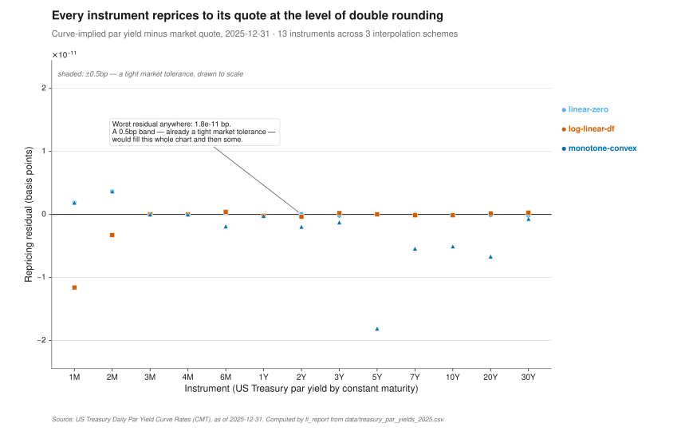
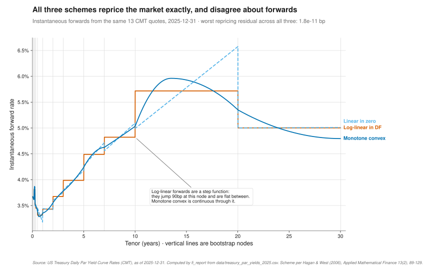
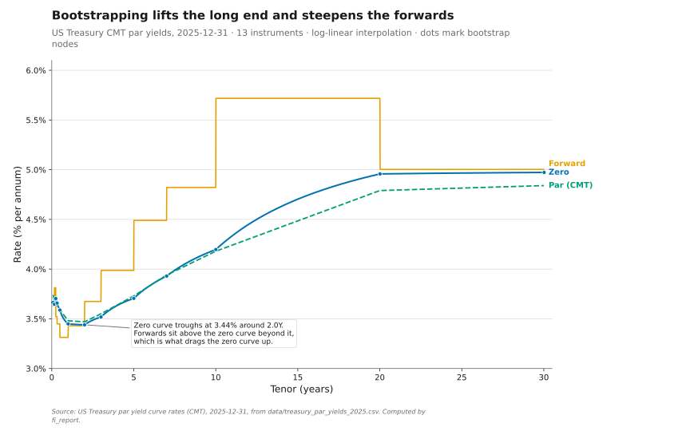
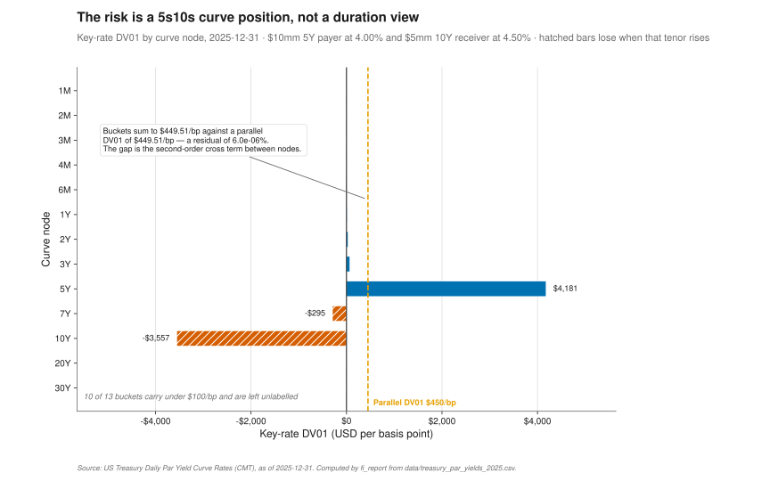
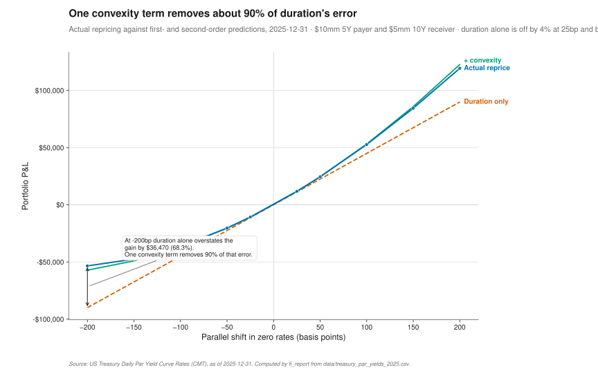

# fixed_income_engine

A C++20 library for the numerical core of a rates desk: building a discount
curve from market instruments, valuing bonds and swaps off it, and measuring
what happens to that value when rates move.

Apache-2.0 · C++20 · CMake ≥ 3.20

## Results

Every number below is written by `./build/fi_report`, which reads published US
Treasury par yields and produces the files under [`reports/`](reports/). CI
reruns it and fails if any committed artifact changes, so nothing here can drift
away from the code.

| | Result | Artifact |
|---|---|---|
| Bootstrap repricing | Worst residual **1.8×10⁻¹¹ bp** across 13 instruments × 3 interpolation schemes | [`repricing_residuals.csv`](reports/repricing_residuals.csv) |
| Curve reproduces the market | Bootstrapped 5Y par rate **3.7300%**, 10Y **4.1800%** — the CMT quotes exactly | [`portfolio_valuation.csv`](reports/portfolio_valuation.csv) |
| Nelson–Siegel–Svensson fit | **2.10 bp** RMSE over 13 tenors; worst tenor **4.21 bp** (20Y) | [`nss_fit.csv`](reports/nss_fit.csv) |
| Key-rate decomposition | Buckets sum to **$449.5135/bp** against a parallel DV01 of **$449.5134/bp** — residual **6.0×10⁻⁶%** | [`key_rate_dv01.csv`](reports/key_rate_dv01.csv) |
| Bucketed hedge | Worst bucket **$4,181/bp → $7.79/bp** using five benchmark swaps | [`bucket_hedge.csv`](reports/bucket_hedge.csv) |
| Convexity | Duration alone is off by **4.3% at 25bp** and **68.3% at −200bp**; one convexity term removes **88–99%** of that | [`shift_attribution.csv`](reports/shift_attribution.csv) |
| Tests | **96 cases / 3,472 assertions**, all passing | `ctest --test-dir build` |

The NSS figure is the one worth reading twice. A 2.10 bp RMSE is *worse* than
the 0.81 bp this README used to claim, and the reason is that the old number was
fitted to ten invented yields. Six parameters cannot interpolate thirteen real
tenors, and 2.10 bp is what the model actually achieves on a real curve.

## Quickstart

```sh
cmake -S . -B build -DCMAKE_BUILD_TYPE=Release
cmake --build build -j
ctest --test-dir build --output-on-failure

./build/fi_report --out reports      # regenerate every artifact under reports/
python3 tools/make_figures.py        # redraw every figure from those artifacts
```

Eigen and Catch2 are used if already installed, and otherwise downloaded from
pinned, SHA-256-verified release tarballs. Behind a proxy that blocks them:

```sh
sudo apt-get install libeigen3-dev catch2   # or: brew install eigen catch2
cmake -S . -B build -DFI_OFFLINE=ON
```

`-DFI_OFFLINE=ON` fails configure with an actionable message rather than
reaching for the network. `-DFI_WERROR=ON` turns warnings into errors, which is
how CI builds.

A second binary, `curve_demo`, exercises the deposit-plus-par-swap bootstrap
path against `data/illustrative_swap_quotes.csv`. Those quotes are hand-written
and labelled as such, because no free USD swap curve exists to replace them.

## What this is

A yield curve answers one question: what is a dollar paid at future time *t*
worth today? That present-value factor is the **discount factor** `DF(t)`, and
the **zero rate** `z(t)` is just its rate form, `DF(t) = exp(−z(t)·t)`.

The market does not quote discount factors. It quotes *instruments* — cash
deposits at the short end, futures and FRAs in the middle, par swap rates or par
bond yields at the long end — and each of those is a bundle of cashflows across
many dates. A 5-year par rate is not "the 5-year zero rate": it is the single
fixed rate that makes a whole strip of semiannual cashflows worth par. Reading
it as a zero rate misprices every cashflow before maturity.

**Bootstrapping** recovers the zero curve underneath, so that repricing each
input instrument *off the curve you built* returns its market quote. Instrument
by instrument, in maturity order:

- a **deposit** gives a discount factor directly, `DF = 1/(1 + r·τ)`;
- a **future or FRA** gives a forward, so `DF(end) = DF(start)/(1 + r·τ)`;
- a **par swap or par bond** is solved for the discount factor at its maturity
  that makes its par rate equal the quote, since `c·Σ α_j·DF(t_j) + DF(T) = 1`.

That description is the textbook one, and it contains an assumption the textbook
usually leaves implicit: that pinning a long node leaves the short end alone.
With linear-in-zero or log-linear interpolation it holds, because a node only
influences the two intervals touching it. With monotone convex interpolation it
does not — a node's instantaneous forward is built from the discrete forwards on
*both* sides, so adding the 10Y node moves the curve back through 7Y and 5Y.
Measured on this data, a one-pass monotone convex bootstrap holds 10⁻¹² bp
through the 2Y node, drifts to 0.009 bp by 3Y and 0.033 bp by 7Y, and ends at
**1.58 bp** once 30Y is added — three orders of magnitude outside a usable
tolerance. So the sequential pass is treated as what it really is, a starting
guess, and every node is then re-solved against the whole curve in Gauss–Seidel
sweeps until each instrument reprices. Log-linear needs no sweeps because it is
already exact, linear-in-zero needs two, monotone convex needs four.

**Why OIS discounting.** Before 2008 a single LIBOR curve both projected
floating coupons and discounted cashflows. The crisis ended that: LIBOR carried
bank credit and liquidity risk, while a collateralised trade is funded at the
overnight rate its CSA pays. The correct present value discounts collateralised
cashflows on the near-risk-free OIS curve while still projecting floating
coupons from the relevant forward curve, which is why a swap PV needs two curves
in general. `Swap::pv(discount, projection)` takes both; the single-argument
form is the single-curve case, which is what makes a bootstrapped swap reprice
to zero. **This repository discounts on the Treasury curve, not an OIS curve**,
because no free redistributable USD SOFR swap curve exists — see
[`data/README.md`](data/README.md) for what was checked and why each candidate
failed. The capability is there; the data is not.

**What a CMT rate actually is.** Treasury's Daily Par Yield Curve Rates are par
yields on hypothetical securities, derived by fitting a curve through bid-side
yields on the on-the-run issues and reading constant maturities off it — with a
**monotone convex spline since 2021-12-06**, and a quasi-cubic Hermite spline
before that. So bootstrapping CMTs gives a zero curve consistent with Treasury's
own interpolation of a handful of on-the-run points, not one implied by the full
cross-section of outstanding bond prices. A curve built from actual bond prices
would disagree, most visibly wherever an individual issue trades special.

## Method

| Area | Source |
|---|---|
| Dates and day counts | [`date.hpp`](include/fi/date.hpp), [`day_count.hpp`](include/fi/day_count.hpp) |
| Curves and interpolation | [`curve.hpp`](include/fi/curve.hpp), [`curve.cpp`](src/curve.cpp) |
| Bootstrapping | [`bootstrap.hpp`](include/fi/bootstrap.hpp), [`bootstrap.cpp`](src/bootstrap.cpp) |
| NSS fitting (Levenberg–Marquardt, Eigen) | [`nss.hpp`](include/fi/nss.hpp), [`nss.cpp`](src/nss.cpp) |
| Bonds, accrued interest, Z-spread | [`bond.hpp`](include/fi/bond.hpp), [`bond.cpp`](src/bond.cpp) |
| Swaps, PV01, leg breakdown | [`swap.hpp`](include/fi/swap.hpp), [`swap.cpp`](src/swap.cpp) |
| Risk, key-rate DV01, bucketed hedging | [`risk.hpp`](include/fi/risk.hpp), [`risk.cpp`](src/risk.cpp) |
| Money and the portfolio boundary | [`money.hpp`](include/fi/money.hpp), [`portfolio.hpp`](include/fi/portfolio.hpp) |

**Doubles inside, integers at the edges.** Discounting, root-finding and curve
fitting are approximations of continuous mathematics, and `double` is the
correct representation: the answer is uncertain in the fifth decimal for reasons
that have nothing to do with floating point. A booked notional or a P&L figure
in a report is not an approximation of anything — it is a specific number of
cents. So `Money` holds an `int64_t` count of minor units with a currency tag,
the minor-unit scale comes from a per-currency exponent rather than an assumed
100 (JPY has none), `from_double` rounds half to even and says so, and there is
no implicit conversion in either direction and no `operator*(double)`. The
boundary runs through `SwapPosition::to_swap` and `value_portfolio`, and nowhere
else.

One visible consequence: portfolio totals are summed in minor units from the
already-rounded rows, so a report's rows always add to its total. That total can
differ from rounding the unrounded sum by up to half a minor unit per position,
so [`portfolio_valuation.csv`](reports/portfolio_valuation.csv) prints both
(`8771.15` and `8771.157724`) instead of picking one.

## Figures

All figures are SVG, regenerated by `python3 tools/make_figures.py` from the
CSVs in `reports/`, and deterministic — unchanged input gives a byte-identical
file.

### The bootstrap closes



Each marker is one instrument's curve-implied par yield minus its market quote,
for each of the three interpolation schemes. Read the y-axis scale first: it is
in units of 10⁻¹¹ basis points, and the shaded band is ±0.5 bp — already a tight
market tolerance — drawn to the same scale. Every instrument reprices to the
level of double rounding, which is the claim the rest of the engine rests on.

### Interpolation is a free choice, and it shows up in the forwards



The same 13 quotes, bootstrapped three ways, plotted as instantaneous forward
rates. All three reprice the market identically and their zero curves are nearly
indistinguishable — they differ by at most 11.5 bp anywhere off-node — and the
forwards are not. Log-linear interpolation makes the forward a step function
that jumps 89.6 bp at the 10Y node, linear-in-zero makes it sawtooth, and
monotone convex ([Hagan–West 2006](#references)) is continuous —
so the choice of interpolation is unconstrained by the data and entirely visible
in the thing traders actually quote.

### Par, zero and forward



The market's par yields (dashed), the zero curve bootstrapped from them, and the
forwards implied by that zero curve, with dots at the bootstrap nodes. Read the
gap between par and zero at the long end: it is what the bootstrap recovers, and
it is why a 30Y par yield of 4.84% corresponds to a 30Y zero of 4.97%. The
forwards sit above both beyond the 2Y trough, which is what drags the zero curve
up.

### The same curve as prices


Discount factors on a log axis above, the zero rates implied by them below. Read
the top panel as the multipliers every cashflow in a bond or swap is valued
with: a dollar at 30 years is worth 22.5 cents today. The two panels are the
same information in the two forms a desk uses, prices and rates.

### Where the risk sits



Each bar is the book's P&L for a 1 bp move in that one curve node, with the
others held still; hatched bars lose when that tenor rises. Read the 5Y and 10Y
bars against the dashed parallel DV01 line: +$4,181/bp against −$3,557/bp nets
to +$450/bp, so this is a 5s10s curve position rather than a duration view. The
buckets sum to the parallel DV01 to within 6×10⁻⁶%, and the gap is the
second-order cross term between nodes, not an error.

### Where duration stops working



Actual repricing against the first-order (duration) and second-order (duration
plus convexity) predictions across ±200 bp. Read the widening gap between the
dashed line and the markers: duration alone is off by 4.3% at 25 bp and by 68.3%
at −200 bp. One convexity term removes 88–99% of that error at every shift,
which is why the second-order term earns its place and the third does not.

### The book under standard scenarios


P&L under the desk-standard curve moves, sorted by magnitude, each labelled with
the shift it actually applies rather than a codename. Read the signs: gains on a
sell-off and on a flattening, losses on a steepening and on a belly-led
butterfly. That is the same position the key-rate chart shows, seen through
moves a trader would actually quote.

## Validation

**Repricing.** Every bootstrap instrument is repriced off the curve it helped
build. Across 13 instruments and 3 interpolation schemes the worst residual is
1.8×10⁻¹¹ bp; the full table is
[`repricing_residuals.csv`](reports/repricing_residuals.csv). This is internal
consistency, but it is the specific consistency that matters: a curve that does
not return the market is not a curve of that market.

**External check.** `tests/test_analytics.cpp` prices Hull's worked two-year bond
(chapter 4: principal 100, 6% semiannual coupon, continuously compounded zeros
of 5.0%, 5.8%, 6.4% and 6.8%) and reproduces all three of his published figures
— price 98.39, yield 6.76%, two-year par yield 6.87%. This is the one number in
the repository that the repository did not produce.

**Key-rate reconciliation.** Key-rate DV01s are supposed to decompose the
parallel DV01 and do not do so exactly. A parallel shift moves the curve
*between* nodes as well as at them; bumping one node reaches the interior only
through that node's local influence. What is left over is the second-order cross
term. Measured: $449.5135 against $449.5134, a residual of 6.0×10⁻⁶%. The
number is reported rather than asserted to be zero.

**NSS fit.** Six parameters against 13 tenors, so the fit cannot interpolate.
RMSE 2.10 bp, worst tenor 4.21 bp at 20Y —
[`nss_fit.csv`](reports/nss_fit.csv) has the per-tenor residuals. The fit uses a
multi-start sweep over the decay scales because NSS is non-convex in λ₁ and λ₂
and a single rule-of-thumb start stalls in a poor local minimum.

**Cross-scheme agreement.** All three interpolation schemes reprice the same
market and produce zero curves that agree exactly at every node by construction
and to within 11.5 bp anywhere off-node. Where they disagree is documented
rather than hidden, because that disagreement is the modeller's free choice
rather than anything the market fixed.

**Closed-form checks.** Zero-coupon duration and convexity against their
analytic values, analytic DV01 against a central finite difference to 1e-6,
yield round-trips to 1e-9, a swap hedged by its own mirror returning notional
1:1, and a 5y5y forward swap blending into the 10y par rate by annuity weights.

## Limitations

I would want a reader to know all of the following before trusting a number out
of this.

**The NSS RMSE got worse when I fixed the data, and I published the worse
number.** The 0.81 bp this README used to claim was a fit to ten yields I had
invented. On 13 real CMT tenors the same code achieves 2.10 bp. Nothing was
tuned to recover the nicer figure.

**CMT rates are Treasury's spline output, not bond prices.** I am bootstrapping
a curve that has already been smoothed by somebody else's interpolator — monotone
convex since 2021-12-06. The result is internally consistent and reproduces the
CMT quotes exactly, but it is not the curve implied by the cross-section of
traded Treasury prices, and it cannot show me an issue trading special. Doing
this properly means starting from CUSIP-level prices, which are not free.

**I discount on Treasuries, not OIS, and that is wrong in a way I can name.** A
Treasury curve is not an OIS curve; the spread between them is the swap spread,
which is a traded quantity, not noise. The engine takes separate discount and
projection curves and would do the right thing given the data. I could not find
free redistributable USD SOFR swap quotes — FRED's SOFR averages are
backward-looking realised compounds, the ICE Swap Rate series now 404, and CME
Term SOFR is licensed. So the gap is data, not capability, and everything in the
Results table should be read as "on the Treasury curve".

**Single currency, no cross-currency basis.** `Money` carries a currency tag and
refuses to add across currencies, which is the right foundation, but there is no
FX and no cross-currency basis anywhere in the engine.

**No credit.** Every cashflow is treated as risk-free or fully collateralised.
There is no CVA, DVA, FVA or default modelling. The Z-spread is the only
credit-adjacent quantity here and it is a spread over a curve, not a hazard rate.

**No calendars or holidays.** Supported: Act/360, Act/365 Fixed, and US (NASD)
30/360. Schedules are generated by stepping whole months backwards from
maturity, which handles end-of-month clamping correctly but does *not* apply any
business-day convention — no Following, no Modified Following, no holiday
calendar. A payment date that lands on a weekend stays on the weekend. For the
par instruments here that is a sub-basis-point effect; for a real trade booked
against a real settlement calendar it is not acceptable.

**Act/Act (ICMA) is missing, and the reason is structural.** ICMA needs to know
which coupon period it is in, not just two dates, so it does not fit the
`year_fraction(d1, d2, convention)` signature the rest of the library is built
on. I use 30/360 for the par bond accrual, which gives exactly 0.5 for the
regular semiannual periods a CMT rate describes — identical to ICMA for a
regular period — so the approximation costs nothing *here*. It would cost
something on a bond with a stub period.

**The short end of the CMT curve is treated as something it is not.** The 1, 2,
3, 4 and 6 month constant maturities come from bills, which pay no coupon and
are quoted on a coupon-equivalent basis. I bootstrap them as single-payment par
instruments on 30/360. That is a simplification I would not make in production.

**No futures convexity adjustment.** `FuturesQuote` converts a futures rate to a
forward with no adjustment at all. A futures contract is margined daily, so its
implied rate exceeds the true forward by roughly ½σ²T₁T₂ under a Hull–White-type
model; ignoring it overstates forwards at the long end of the futures strip. A
proper treatment needs a short-rate volatility, which means a calibrated model,
which is out of scope here. The code says so at the declaration; it is not
silently applied.

**Monotone convex cannot represent negative forwards.** The Hagan–West
positivity collar bounds node forwards into `[0, 2·min(adjacent discrete
forwards)]`. Where the data implies a negative discrete forward — which happened
in EUR and JPY for most of the 2010s — this scheme will not reproduce it. A test
pins that behaviour so it is a documented limit rather than a surprise.

**Key-rate DV01 buckets are curve nodes, not standard hedge buckets.** They fall
where the input instruments fall. A desk would want a fixed bucket set
independent of which instruments happened to be quoted that day.

**The hedge solve ignores everything except key rates.** No bid-offer, no
liquidity weighting, no notional rounding to tradeable sizes, no constraint that
you cannot trade $-105.49 of a 30Y swap. It is the least-squares answer to a
linear problem, which is the right first step and not a trade ticket.

**Performance is unmeasured.** There is no benchmark in this repository and I
make no speed claims. The bootstrap rebuilds a curve object inside every solver
iteration, which is clearly wasteful; I left it because correctness mattered
more and because nothing here is on a hot path.

## Data sources

| Source | URL | As of | Licence / terms | Refresh |
|---|---|---|---|---|
| US Treasury Daily Par Yield Curve Rates (CMT) | [home.treasury.gov](https://home.treasury.gov/resource-center/data-chart-center/interest-rates/TextView?type=daily_treasury_yield_curve) | 2025-01-02 to 2025-12-31, 249 business days | US Government work, no domestic copyright (17 U.S.C. 105) | `python3 scripts/fetch_treasury_curve.py --year 2025` |
| SOFR overnight fixing (reference only; no curve is built from it) | [fred.stlouisfed.org/series/SOFR](https://fred.stlouisfed.org/series/SOFR) | 2025-01-02 to 2025-12-31, 249 observations | FRED terms of use; SOFR published by the New York Fed | `python3 scripts/fetch_sofr.py --year 2025` |
| `data/illustrative_swap_quotes.csv` | — hand-written, **not market data** | n/a | n/a | edit by hand |

Each downloaded CSV has a `.meta.json` sibling carrying the source URL, UTC
retrieval time, the git commit of the fetching code, the row count, the date
span and a SHA-256 of the file. [`data/README.md`](data/README.md) has the full
provenance notes and the snippet that verifies a file against its record.

## References

- Hagan, P. S. and West, G. (2006). "Interpolation Methods for Curve
  Construction." *Applied Mathematical Finance* 13(2), 89–129.
  [doi:10.1080/13504860500396032](https://doi.org/10.1080/13504860500396032).
  The monotone convex scheme in `src/curve.cpp` follows section 4, including the
  four-region closed form for the forward deviation and the positivity collar.
- Hull, J. C. *Options, Futures, and Other Derivatives*, chapter 4 (Interest
  Rates). The worked two-year bond example used as the external validation in
  `tests/test_analytics.cpp`.
- Andersen, L. and Piterbarg, V. (2010). *Interest Rate Modeling*, volume 1. The
  serious treatment of multi-curve construction and OIS discounting, and the
  source for what a proper futures convexity adjustment would require.
- US Department of the Treasury. "Treasury Yield Curve Methodology."
  [home.treasury.gov](https://home.treasury.gov/policy-issues/financing-the-government/interest-rate-statistics/treasury-yield-curve-methodology)
  — the documented change to a monotone convex spline on 2021-12-06.

## Licence

Apache-2.0. See [LICENSE](LICENSE) and [NOTICE](NOTICE); the latter records the
licence and source of each redistributed dataset.
