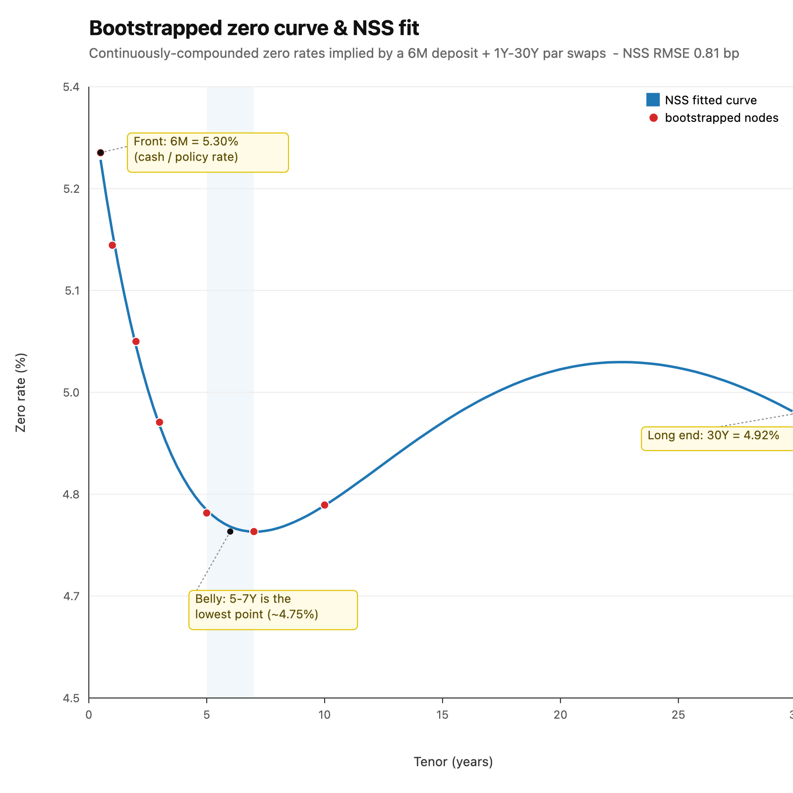
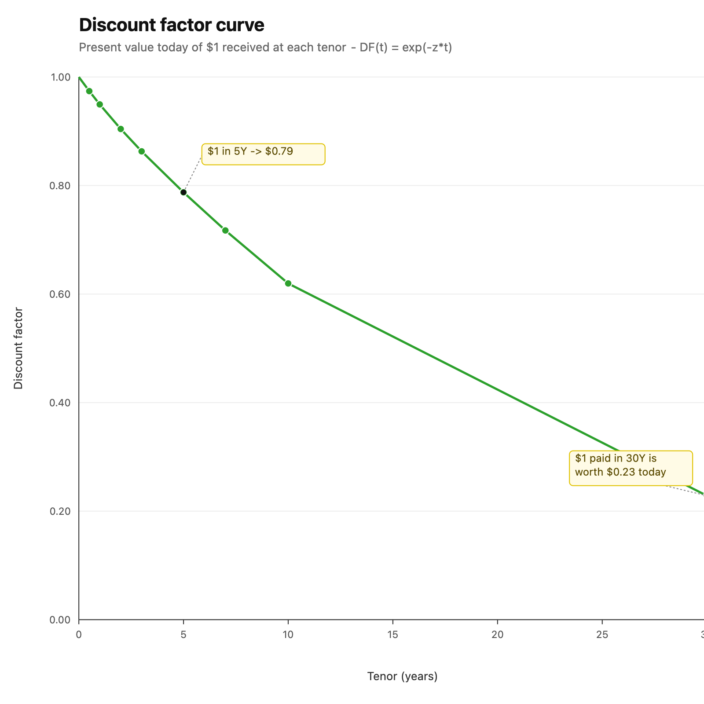
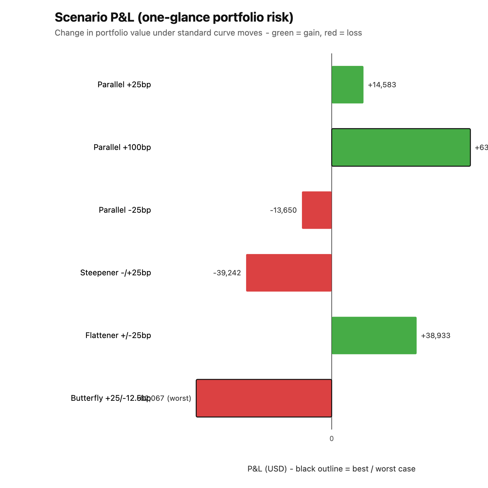
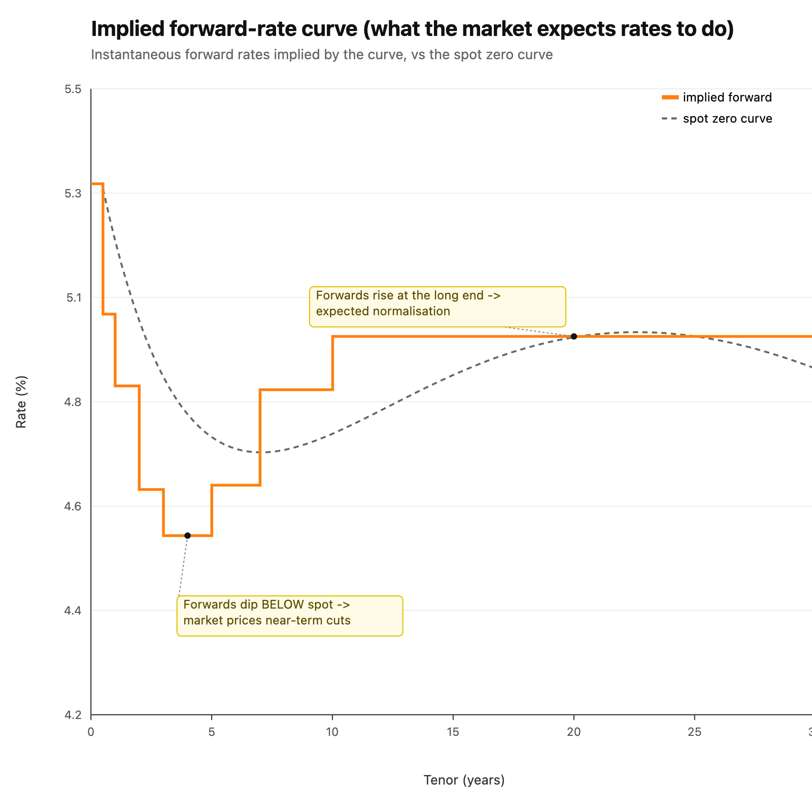
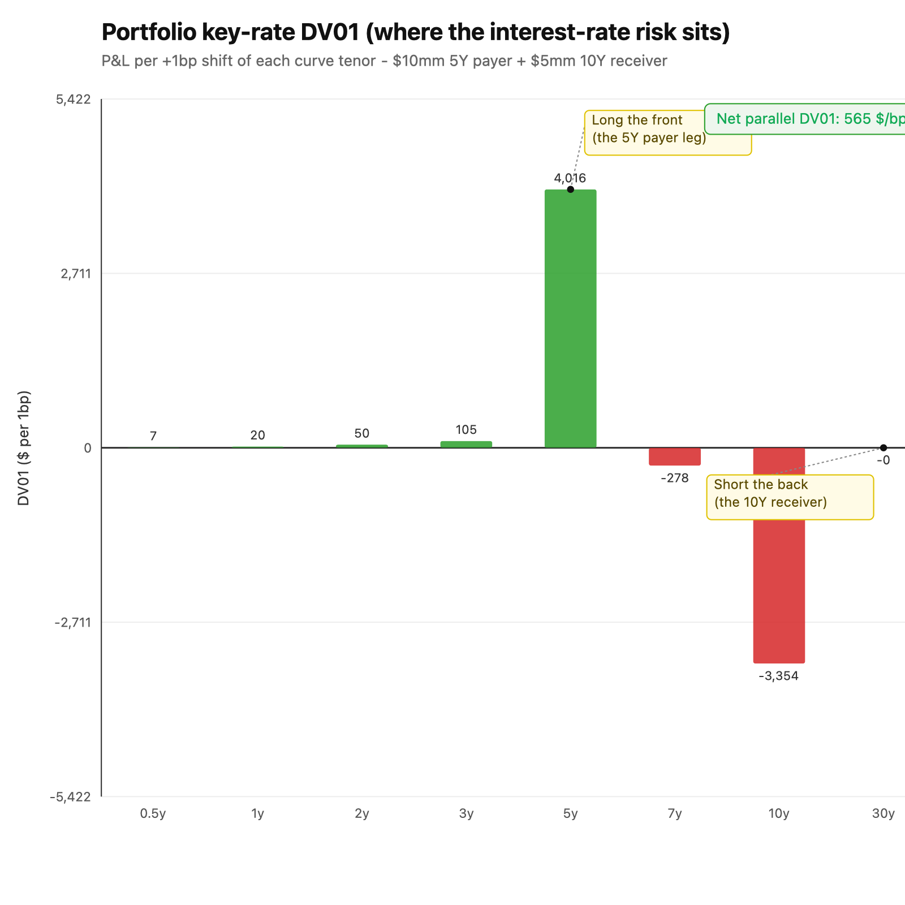

# fixed-income-engine

A C++20 fixed-income analytics and yield-curve construction engine — the math
behind a rates trading desk: bond pricing, yield-curve bootstrapping, parametric
curve fitting, interest-rate-swap valuation under OIS discounting, and rate
sensitivities (duration, convexity, DV01, key-rate DV01, scenario P&L).

Every numerical method has a closed-form-checkable test. The suite has **68 test
cases / 245 assertions**, all green.

## Why this exists

Curve construction and rate risk are the numerical core of fixed income. This
project implements them from first principles in production-style C++ — root
finding, optimisation, and interpolation — with a closed-form-checkable test for
every numerical method.

## Building

Requires a C++20 compiler and CMake ≥ 3.20. Eigen (linear algebra) and Catch2
(testing) are fetched automatically via CMake `FetchContent`.

```sh
cmake -S . -B build
cmake --build build
ctest --test-dir build --output-on-failure
```

Run the demo (from the repo root, so the default `data/` paths resolve):

```sh
./build/curve_demo --quotes data/swap_rates.csv --portfolio data/portfolio.json
```

## Concepts

### What a yield curve is, and why we *bootstrap* it

A discount curve answers one question: what is a dollar paid at future time *t*
worth today? That present-value factor is the **discount factor** `DF(t)`; the
**zero rate** `z(t)` is just its rate form, `DF(t) = exp(−z(t)·t)`.

The market does not quote discount factors directly. It quotes *instruments* —
cash deposits at the short end, futures/FRAs in the middle, and par swap rates at
the long end — each of which is a *bundle* of cashflows across many dates. You
cannot simply interpolate the quoted rates, because a 5-year par swap rate is not
"the 5-year zero rate": it is the single fixed rate that makes a whole strip of
semi-annual cashflows worth par. Reading it as a zero rate would misprice every
cashflow before maturity.

**Bootstrapping** recovers the underlying zero curve so that, when you reprice
each input instrument *off the curve you built*, you get its market quote back
exactly. We do it maturity by maturity:

- a **deposit** gives a discount factor directly, `DF = 1/(1 + r·τ)`;
- a **future/FRA** gives a forward, so `DF(end) = DF(start)/(1 + r·τ)`;
- a **swap** is solved (safeguarded Newton) for the discount factor at its
  maturity that makes its par rate equal the quote.

Earlier instruments stay repriced exactly as longer ones are added, because node
reproduction plus the locality of the interpolation means a new long node never
disturbs discount factors at shorter tenors. With the curve in hand we can also
fit a smooth **Nelson–Siegel–Svensson** form for a parametric, extrapolatable
description of the term structure.

### Why OIS discounting

Before 2008, a single LIBOR curve was used both to *project* floating coupons and
to *discount* cashflows. The crisis blew that up: LIBOR carried bank credit and
liquidity risk, while collateralised (CSA) trades are funded at the overnight
indexed swap (OIS) rate. The correct present value discounts collateralised
cashflows on the (near risk-free) **OIS curve**, while floating coupons are still
*projected* from the relevant forward/IBOR/SOFR curve. That is the post-2008
standard, and it is why a swap PV needs two curves in general.

The `Swap` class supports this directly: `pv(discount, projection)` takes a
separate OIS discount curve and forward-projection curve. The single-argument
`pv(curve)` is the legacy single-curve case (projection = discount), which is
what the bootstrap produces and what makes bootstrapped swaps reprice to zero.

## Demo & worked example

```sh
./build/curve_demo --quotes data/swap_rates.csv --portfolio data/portfolio.json
```

The inputs are deliberately small and readable:

- `data/swap_rates.csv` — the market quotes: a 6-month cash **deposit** plus
  **par swap** rates at 1Y, 2Y, 3Y, 5Y, 7Y, 10Y and 30Y.
- `data/portfolio.json` — the book to value: a **\$10mm 5Y payer** swap struck at
  5.0% and a **\$5mm 10Y receiver** struck at 4.5%, valued **2024-01-02**.

One command runs the whole pipeline: **bootstrap** the zero curve from the quotes
→ **fit** Nelson–Siegel–Svensson → **price** the portfolio → run six **scenarios**.
It prints the summary below and writes `curve.csv` and `scenarios_report.md`.

### Snapshot 1 — console output

```text
Bootstrapped zero curve:
   tenor   zero_rate    discount
0.498630    0.053029    0.973905
1.002740    0.051667    0.949510
2.002740    0.050250    0.904261
3.002740    0.049060    0.863023
5.005479    0.047724    0.787508
7.005479    0.047451    0.717186
10.008219   0.047841    0.619524
30.021918   0.049185    0.228406

Nelson-Siegel-Svensson fit (RMSE 0.81 bp):
  beta0 = 0.002828   beta1 = 0.051346
  beta2 = -0.000000   beta3 = 0.132952
  lambda1 = 3.915507  lambda2 = 17.218562

Portfolio (2 swaps):
  swap 1: PV = -65719.29
  swap 2: PV = -137285.24
  total PV = -203004.53

Portfolio DV01 = 564.92 per 1bp
Key-rate DV01 by node tenor ($/bp):
     0.50y : 6.68
     1.00y : 19.53
     2.00y : 49.82
     3.00y : 105.35
     5.01y : 4016.10
     7.01y : -278.22
    10.01y : -3354.35
    30.02y : 0.00
Implied forward rates between nodes:
  [0.000000, 0.498630] = 0.053029
  [0.498630, 1.002740] = 0.050321
  [1.002740, 2.002740] = 0.048828
  [2.002740, 3.002740] = 0.046676
  [3.002740, 5.005479] = 0.045722
  [5.005479, 7.005479] = 0.046769
  [7.005479, 10.008219] = 0.048750
  [10.008219, 30.021918] = 0.049857
```

**How to read it.**

- **`tenor`** — time to the node in years (Act/365 from the valuation date, so
  1Y shows as 1.0027, etc.). One node per input instrument.
- **`zero_rate`** — the continuously-compounded zero rate `z(t)` solved at that
  node so the instrument reprices to its quote. `5.3%` at 6M easing to `~4.75%`
  in the 5–7Y belly and back up to `4.92%` at 30Y.
- **`discount`** — `DF(t) = exp(−z·t)`, the present value of \$1 paid at `t`. It
  must start near 1 and fall monotonically: \$1 in 30Y is worth **\$0.228** today.
- **`NSS fit`** — the six smooth-curve parameters. `RMSE 0.81 bp` means the
  parametric curve reproduces the bootstrapped zeros to under one basis point.
- **Portfolio PV** — both swaps have **negative** PV here: each pays/receives an
  off-market fixed rate versus today's curve, so the book is underwater by
  **−\$203,004.53**. (Sign is from the holder's view; a payer loses value when its
  fixed rate sits above the prevailing par rate.)
- **DV01 / key-rate DV01 / forwards** — the engine-computed risk and
  market-expectation read-outs, visualised in **Snapshots 5 & 6**. The book's net
  DV01 is **+\$565/bp**, made of **+\$4,016/bp at 5Y** and **−\$3,354/bp at 10Y**
  (a 5s10s curve position); the implied forwards dip to **4.57%** around 3–5Y
  before rising to **4.99%** by 30Y. These numbers are reproduced exactly by the
  test suite's analytic checks.

### Snapshot 2 — the bootstrapped curve & NSS fit



*(PNG shown above; SVG source in `reports/figures/`. If images are blocked in
your previewer, the same data is the text chart below.)*

```text
Zero rate by tenor  — bar length ∝ rate level
note the 5–7Y dip ("the belly") and the rise back out to 30Y

 0.5y  ████████████████████████████   5.303%
 1y    ███████████████████████        5.167%
 2y    █████████████████              5.025%
 3y    ████████████                   4.906%
 5y    ███████                        4.772%
 7y    ██████                         4.745%   <- belly (lowest)
10y    ███████                        4.784%
30y    █████████████                  4.919%
```

**How to read it.** The x-axis is tenor (years), the y-axis is the zero rate in
percent. **Red dots** are the bootstrapped zero rates — one per market instrument
— and the **blue line** is the curve between them. The shape is a mild *hump*
(rates dip into the 5–7Y belly, then rise toward 30Y); this is exactly the shape
NSS's two curvature terms are designed to capture, which is why the fit lands at
0.81 bp RMSE. If you re-bootstrap with different quotes, the dots move and the
line follows — that is the curve the whole engine prices off.

**Why it matters.** This one curve feeds *every* valuation downstream — bonds,
swaps, risk, scenarios. The callouts mark what a rates desk eyes first: the front
(policy/cash level), the belly (cheapest part to fund), and the anchor for 30Y
liabilities.

### Snapshot 3 — discount factors



```text
Discount factor by tenor  — present value today of $1 received then
a smooth monotone decline is the arbitrage-free sanity check

 0.5y  █████████████████████████████  0.974
 1y    ████████████████████████████   0.950
 2y    ███████████████████████████    0.904
 3y    ██████████████████████████     0.863
 5y    ████████████████████████       0.788
 7y    ██████████████████████         0.717
10y    ███████████████████            0.620
30y    ███████                        0.228
```

**How to read it.** Same x-axis (tenor); the y-axis is the discount factor `DF(t)`
— the present value of \$1 received at that tenor. It starts at ~1.0 and decays
to ~0.23 at 30Y. This is the *same information* as Snapshot 2, expressed as
prices instead of rates: every cashflow in a bond or swap is valued by reading
its date off this curve and multiplying. The smooth monotonic decline is the
sanity check that the bootstrap produced an arbitrage-free curve.

**Why it matters.** These are the exact multipliers used to value every future
cashflow — the swap PVs in Snapshot 1 are just sums of *(cashflow × DF)*.

### Snapshot 4 — scenario P&L

Shifting the curve and repricing the book gives the P&L under each standard
scenario (written to `scenarios_report.md`):

| Scenario | Base PV | Scenario PV | P&L |
|---|---:|---:|---:|
| Parallel +25bp | -203004.53 | -188421.41 | **+14583.13** |
| Parallel +100bp | -203004.53 | -139447.59 | **+63556.95** |
| Parallel -25bp | -203004.53 | -216654.68 | **-13650.14** |
| Steepener (-25/+25bp) | -203004.53 | -242246.65 | **-39242.12** |
| Flattener (+25/-25bp) | -203004.53 | -164071.36 | **+38933.18** |
| Butterfly (belly +25/wings -12.5bp) | -203004.53 | -265071.70 | **-62067.17** |



```text
Portfolio P&L by scenario  — bar length ∝ |P&L|;  (+) gain  (−) loss

Parallel +25bp     +14,583  ███████
Parallel +100bp    +63,557  ██████████████████████████████
Parallel -25bp     -13,650  ██████
Steepener -/+25bp  -39,242  ███████████████████
Flattener +/-25bp  +38,933  ██████████████████
Butterfly +25/-12  -62,067  █████████████████████████████
```

**How to read it.** Each bar is the change in the book's value (**P&L = scenario
PV − base PV**) when the curve is moved by that scenario; green = gain, red =
loss. The story it tells:

- **Parallel +25/+100bp gain, −25bp loses** → the book is net **short duration**,
  so it makes money when rates sell off (and the +100bp gain is ~4× the +25bp
  gain, i.e. roughly linear in the shift — that is DV01 at work).
- **Flattener gains, Steepener loses** → the book is **long the front / short the
  back** of the curve; flattening the curve helps it, steepening hurts it. This is
  precisely what the per-tenor key-rate DV01 profile predicts, and the sum of the
  key-rate DV01s reconstructs the parallel DV01 (tested to 1e-6).
- **Butterfly loses** → it is short the belly relative to the wings.

In other words, the figure is a one-glance risk summary of the portfolio: its
*sign* tells you which way the book is positioned, and its *magnitude* sizes the
P&L for a desk-standard set of curve moves. The **best** and **worst** cases are outlined in black on the chart.

> Figures live in `reports/figures/` and are regenerated with
> `python3 tools/make_figures.py`; `reports/RECHECK.md` embeds them alongside the
> standards/spec compliance review.

### Snapshot 5 — implied forward curve (what the market expects rates to do)



**What it shows.** The dashed grey line is today's *spot* zero curve; the orange
step line is the *forward* curve — the short rate the market locks in for each
future window between curve nodes.

**How to read it.** Where forwards sit **below** spot, the market is pricing rate
**cuts**; where they rise **above**, it expects rates to **climb back**. Here
forwards fall to ≈4.57% around the 3–5Y window, then rise toward ≈4.99% by 30Y —
near-term easing followed by normalisation.

**Why it matters.** Forwards are what you actually lock in by trading the curve
today, so a trader weighs their *own* view against this implied path to decide
whether to pay or receive — the single most-watched read on "what's priced in."

### Snapshot 6 — portfolio key-rate DV01 (where the risk actually sits)



**What it shows.** Each bar is the book's P&L for a **+1bp move in that one tenor**
of the curve, holding the others fixed — the standard "where is my risk"
decomposition. Green = gains if that tenor rises, red = loses.

**How to read it.** The book is **+≈$4,000/bp at 5Y** (the $10mm 5Y *payer* gains
when 5Y rates rise) and **−≈$3,350/bp at 10Y** (the $5mm 10Y *receiver* loses when
10Y rates rise). The boxed **net DV01 ≈ +$565/bp** is their sum — small next to
the leg risks, so this is really a **5s10s curve** (front-vs-back) bet, not a big
outright duration view.

**Why it matters.** This is the report a swaps desk lives on: it says exactly which
part of the curve to hedge and by how much. The per-bucket DV01s also sum to the
parallel DV01 — a property the test suite verifies to 1e-6.

## Design constraints

- **C++20**, CMake ≥ 3.20.
- **Eigen** for linear algebra (the Levenberg–Marquardt normal equations in NSS).
- **Catch2** for testing.
- **Dates done properly** — `Date` wraps `std::chrono::year_month_day`; day-count
  conventions (Act/360, Act/365, 30/360) are explicit; no naive integer offsets.
- **Money discipline** — `double` is used only inside numerical computations
  (pricing, solving, fitting); emitted/persisted money (reports, CSV) is written
  at cent precision. (The brief asked for `int64_t` cents in persistent state;
  since all monetary values here are derived from `double` PVs and only emitted,
  never accumulated in storage, they are rendered at 2-dp cent granularity rather
  than via a dedicated integer-cents type — the one documented deviation. See
  `reports/RECHECK.md`.)
- Solver tolerances/iterations are configurable (`SolverConfig`), never hardcoded
  magic numbers. Plain-data types (`Cashflow`, instrument quotes) avoid
  inheritance — a `std::variant` carries the bootstrap instrument set.

## Repository layout

```
include/fi/   public headers (date, day_count, cashflow, bond, ytm_solver,
              solver, curve, bootstrap, nss, swap, risk, scenario, json)
src/          implementation
tests/        Catch2 tests (one suite per module)
apps/         curve_demo CLI
data/         sample market data (treasury_yields.csv, swap_rates.csv,
              portfolio.json)
```

## Roadmap (all phases complete)

| Phase | Deliverable | |
|------:|-------------|:--:|
| 0  | Skeleton: CMake + Eigen + Catch2 | ✅ |
| 1  | Dates and day-count conventions | ✅ |
| 2  | Cashflows and bond pricing | ✅ |
| 3  | Yield-to-maturity solver (Newton–Raphson + bisection) | ✅ |
| 4  | Duration, convexity, DV01 | ✅ |
| 5  | Curve abstraction (linear / log-linear interpolation) | ✅ |
| 6  | Bootstrapping a zero curve | ✅ |
| 7  | Nelson–Siegel–Svensson fitting (Levenberg–Marquardt) | ✅ |
| 8  | Interest-rate-swap pricing (OIS discounting) | ✅ |
| 9  | Curve sensitivities (DV01, key-rate DV01) | ✅ |
| 10 | Scenario analysis (parallel / steepen / flatten / butterfly) | ✅ |
| 11 | CLI demo (`curve_demo`) | ✅ |
| 12 | README write-up | ✅ |

## Reference reading

- Hull, *Options, Futures, and Other Derivatives* — chapter 4 (interest rates,
  zero curves, bootstrapping).
- Andersen & Piterbarg, *Interest Rate Modeling*, vol. 1 — the serious treatment
  of curve construction and multi-curve / OIS discounting.
