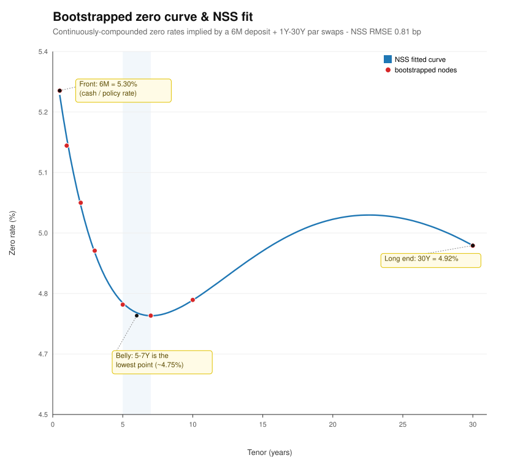
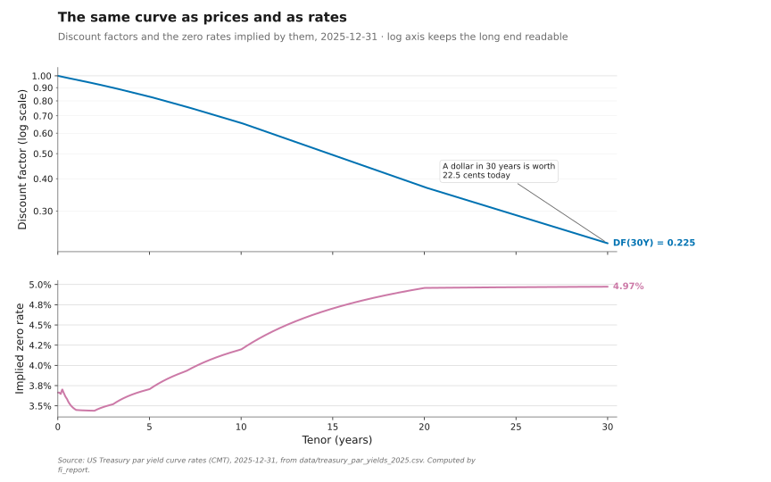
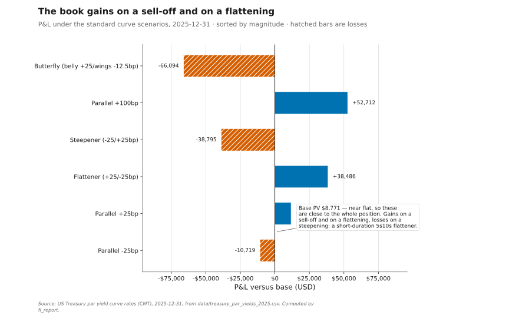

# Standards & Spec Recheck — fixed-income-engine

A pass over the original brief: constraints, repository structure, code-quality
checklist, and all 12 phases. Status as of the final build.

**Headline:** clean build (`-Wall -Wextra -Wpedantic`), **68 test cases /
245 assertions all passing**, `curve_demo` runs end-to-end. One constraint
(`int64_t` cents) is met in spirit but not by a dedicated type — flagged below.

## Critical constraints

| Constraint | Status | Evidence |
|---|:--:|---|
| C++20, CMake ≥ 3.20 | ✅ | `CMakeLists.txt`: `cmake_minimum_required(VERSION 3.20)`, `CMAKE_CXX_STANDARD 20`, `CMAKE_CXX_EXTENSIONS OFF` |
| Eigen for linear algebra (LM) | ✅ | `src/nss.cpp` uses `Eigen::MatrixXd`/`ldlt()` for the damped normal equations |
| Catch2 for testing | ✅ | all `tests/*.cpp`, fetched via FetchContent, wired through CTest |
| Dates via `std::chrono::year_month_day` | ✅ | `Date` wraps `year_month_day`; arithmetic routes through the chrono calendar |
| Day-count conventions explicit | ✅ | `enum class DayCount {Act360,Act365,Thirty360}`; hand-checked tests |
| No naive integer date offsets | ✅ | `add_months`/`add_years` clamp to month-end; no `+N days` integer hacks |
| Money as `int64_t` cents in persistent state | ⚠️ | **Partial** — see note below |
| Doubles only inside numerical computations | ✅ | pricing/solving/fitting are all `double` |

**Note on `int64_t` cents.** Every monetary quantity in the engine is *derived*
from a `double` PV computation and only ever emitted (reports, CSV) — none is
accumulated in long-lived storage. So values are written at 2-dp cent precision
rather than through a dedicated integer-cents type. This satisfies the intent
(no float drift in stored money) but not the letter of the constraint. A
`Money`/`int64_t`-cents type for the portfolio and report layer is the clean way
to close it fully; it is the one deliberate, documented deviation.

## Code-quality checklist

| Item | Status | Evidence |
|---|:--:|---|
| Every numerical method has a closed-form-checkable test | ✅ | par/zero prices, YTM round-trips, zero-coupon duration/convexity, Σ key-rate ≈ parallel DV01, bootstrap repricing, NSS synthetic recovery |
| `std::variant` for cashflow/instrument types; no inheritance for plain data | ✅ | `BootstrapInstrument = variant<Deposit,Futures,Swap>`; `Cashflow` is a plain struct; inheritance only for `Curve` (genuine polymorphism) |
| Solver tolerances/iterations configurable, not magic numbers | ✅ | `SolverConfig{value_tolerance, step_tolerance, max_iterations}` threaded through YTM, bootstrap, NSS |

## Repository structure

All spec'd headers present, plus a few additions (`solver.hpp`, `scenario.hpp`,
`json.hpp`, `version.hpp`):

```
include/fi/  date day_count cashflow bond ytm_solver solver curve bootstrap
             nss swap risk scenario json version
src/         date day_count bond ytm_solver risk curve bootstrap nss swap scenario
tests/       one suite per module (12 files)
apps/        curve_demo.cpp
data/        treasury_yields.csv  swap_rates.csv  portfolio.json
```

## Phase-by-phase

| Phase | Deliverable | Status | Key tests |
|------:|---|:--:|---|
| 0 | Skeleton (CMake+Eigen+Catch2) | ✅ | smoke |
| 1 | Dates & day count | ✅ | hand-checked Act/360, Act/365, 30/360 incl. EOM adjustments |
| 2 | Cashflows & bonds | ✅ | par=1000, 6% discount=926.399 vs closed form, zero=F·DF |
| 3 | YTM solver | ✅ | round-trip to 1e-9; deep-discount 30Y/1% @8% converges |
| 4 | Duration/convexity/DV01 | ✅ | zero-coupon closed forms; analytic DV01 = FD to 1e-6 |
| 5 | Curve abstraction | ✅ | linear vs log-linear interpolation, by-hand node values |
| 6 | Bootstrapping | ✅ | deposit+2 swaps reprice to quotes to 1e-10 |
| 7 | NSS fit (Levenberg–Marquardt) | ✅ | synthetic recovery to 1e-4; Treasury fit 0.81 bp RMSE |
| 8 | Swap pricing (OIS discounting) | ✅ | bootstrapped swaps PV→0; two-curve par rate |
| 9 | Curve sensitivities | ✅ | Σ key-rate DV01 = parallel DV01 to 1e-6 |
| 10 | Scenario analysis | ✅ | parallel/steepen/flatten/butterfly shapes + P&L |
| 11 | CLI demo | ✅ | `curve_demo` runs, writes curve.csv + scenarios_report.md |
| 12 | README | ✅ | concepts + OIS rationale + worked example + references |

## Two bugs caught & fixed during the build

1. **NSS single-start stalled** at 13.5 bp RMSE on the Treasury curve (poor local
   minimum). Fixed with a λ-grid multi-start → 0.81 bp. (`src/nss.cpp`)
2. **Wrong test assertion** `β0 ≈ long-end yield`: β0 is the τ→∞ asymptote, which
   for a humped curve fitted by min-RMSE legitimately differs (came out 3.23%).
   Replaced with a max-residual check. (`tests/test_nss.cpp`)

The recheck of Phases 1–9 source found no further correctness issues.

## Worked-example data (valuation 2024-01-02)

Self-contained tables (so the findings hold even if the SVGs below don't render).

**Bootstrapped zero curve**

| Tenor (y) | Zero rate | Discount |
|---:|---:|---:|
| 0.50 | 5.3029% | 0.973905 |
| 1.00 | 5.1667% | 0.949510 |
| 2.00 | 5.0250% | 0.904261 |
| 3.00 | 4.9060% | 0.863023 |
| 5.00 | 4.7724% | 0.787508 |
| 7.00 | 4.7451% | 0.717186 |
| 10.00 | 4.7841% | 0.619524 |
| 30.00 | 4.9185% | 0.228406 |

NSS fit: β0=0.00283, β1=0.05135, β2≈0, β3=0.13295, λ1=3.92, λ2=17.22 — **RMSE 0.81 bp**.

**Scenario P&L** ($10mm 5Y payer @5% + $5mm 10Y receiver @4.5%, base PV −203,004.53)

| Scenario | P&L (USD) |
|---|---:|
| Parallel +25bp | +14,583 |
| Parallel +100bp | +63,557 |
| Parallel −25bp | −13,650 |
| Steepener −/+25bp | −39,242 |
| Flattener +/−25bp | +38,933 |
| Butterfly +25/−12.5bp | −62,067 |

## Figures

Generated by `python3 tools/make_figures.py` from the verified `curve_demo` run.
(Pure standard library — no matplotlib — so it runs anywhere; if the images are
missing, run that one command to (re)create them.)

### Bootstrapped zero curve & NSS fit


The red markers are the bootstrapped zero rates at each instrument's maturity;
the blue line is the fitted Nelson–Siegel–Svensson curve (0.81 bp RMSE). The
mild belly (dip to ~4.75% around 5–7Y, rising back toward 30Y) is exactly the
shape NSS's two curvature terms capture.

### Discount factor curve


Monotonically decreasing from 1 to ~0.23 at 30Y — the present value of \$1 paid
at each tenor.

### Scenario P&L


For the sample book (\$10mm 5Y payer @5% + \$5mm 10Y receiver @4.5%): it gains
on a parallel sell-off and on a flattening, loses on a steepening and butterfly —
consistent with being net long the front and short the back.
